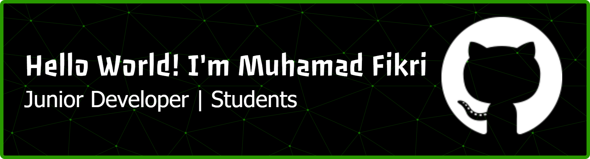

# Halo, Saya Muhamad Fikri! 👋 🤴

# 🏗️ "Coding is a marathon, not a sprint." Saya percaya bahwa menguasai fundamental adalah kunci untuk menjadi developer yang handal.

 

### About me

##### Junior Developer | Students

 

#### Connect with me

    

#### My Skills

  

  

##### My Github Stats

<picture>
  <source media="(prefers-color-scheme: dark)" srcset="https://raw.githubusercontent.com/muhamadfikridev/muhamadfikridev/output/pacman-contribution-graph-dark.svg">
  <source media="(prefers-color-scheme: light)" srcset="https://raw.githubusercontent.com/muhamadfikridev/muhamadfikridev/output/pacman-contribution-graph.svg">
  
</picture>

###